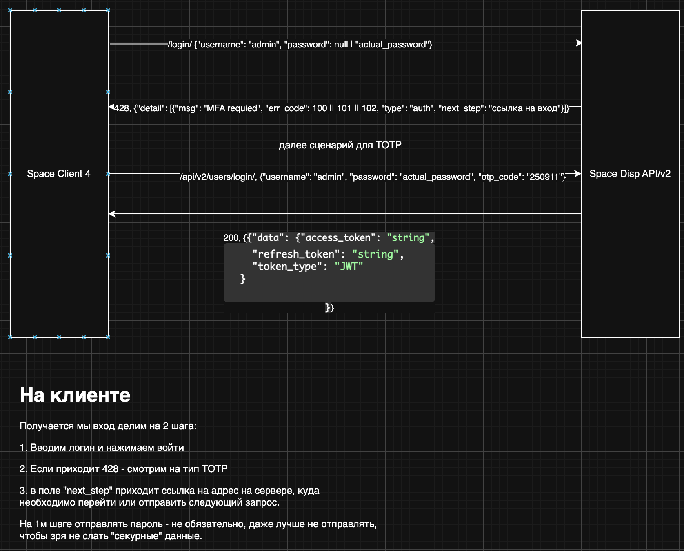
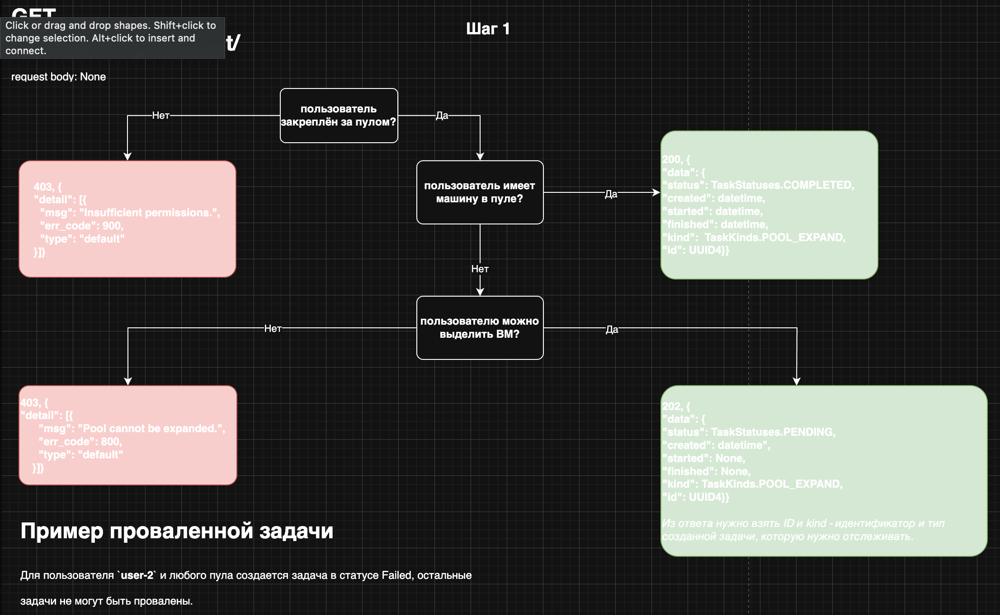
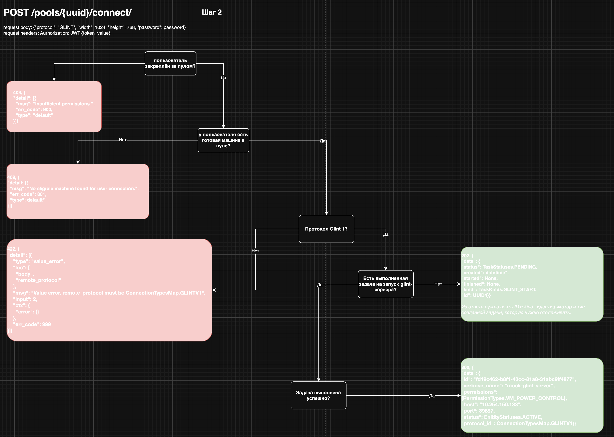
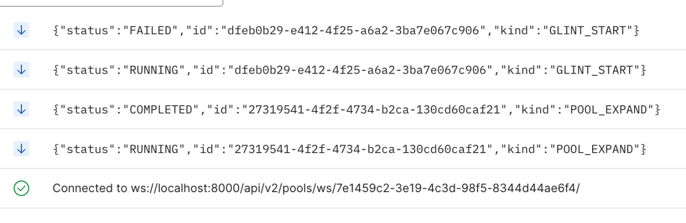

# mockapi
[GitHub](https://github.com/devalv/mockapi)

## Установка и запуск
Для упрощения запуска используются make, поэтому, чтобы воспользоваться готовым набором убедитесь, что в системе установлен make.

### Установка

Для управления зависимостями и виртуальным окружением используется [poetry](https://python-poetry.org/docs/#installing-with-the-official-installer). Прежде чем выполнять `make install` убедитесь, что poetry установлен и команда `poetry --version` работает. Если все хорошо - выполните `make install`.

### Запуск
```bash
make dev
```

## Работа

### Swagger
Swagger-документация после запуска доступна по адресу [http://localhost:8000/docs](http://localhost:8000/docs)

### Описания базовых процессов
#### Вход в систему
Для получения jwt на вход, необходимо отправить POST запрос на **/api/v2/users/login/** (см. swagger).

Валидации пароля нет, т.е. любой отправленный пароль система будет считать корректным. Перечень пользователей можно посмотреть в [core/db.py - fake_users_db](https://github.com/devalv/mockapi/blob/e26de809d1dff65e67b2b4efff904f33bfe6632f/core/db.py#L4C45-L5C1).

Шаги проверок входа пользователя:
1. наличие пользователя в БД
2. атрибуты **otp_enabled**, **adfs_enabled**, **hardware_token_enabled** - если включен хотя бы один из этих параметров - система будет ожидать MFA-стратегии входа от клиента, сейчас можно пройти только сценарий эмулирующий TOTP
3. если в системе активирован otp - значением проверки otp будет текущая дата (на сервере) в формате **%y%m%d**, например, 250911
4. если предудыщие проверки прошли или неактуальны - проверяется атрибут пользователя **disabled**

Примерный процесс входа по OTP


Дальнейшие запросы должны сопровождаться заголовком `Authorization` со значением вида `JWT eyHjbG`.

#### Подключение к машине
Подключение к машине состоит из 2х шагов:
1. Запрос машины для подключения в пуле
2. Запрос данных на подключение к уже созданной машины

Операции асинхронные, т.е. отправив запрос на подключение - будет создана задача, которая выполняется произвольное количество времени (но не более 90 сек.).
Если задача уже создана, при повторном запросе будет возвращена она же, если задача завершилась в статусе, который допускает автоматический перезапуск - будет создана новая задача и возвращена ее информация.

Примерный процесс Шага 1 подключения к машине


Примерный процесс Шага 2 подключения к машине


#### Отслеживание статусов выполнения задачи
Статусы задач можно и нужно отслеживать подписавшись на персонализированные ws.
Адрес подписки - [ws://localhost:8000/api/v2/pools/ws/{client_id}/](ws://localhost:8000/api/v2/pools/ws/{client_id}/)

В качестве уникального **client_id** необходимо использовать значение client_id хранящийся внутри jwt в соответствующем поле, для подписки на ws необходимо передать заголовок `Cookie` вида `JWT eyJhbG`.

Пример сообщеий о статусе выполнения задач по обоим шагам подключения к машине


##
TODO: tests - сейчас тестов нет, т.к. api ещё на этапе валидации, а внутренние функции это моки без какой-либо бизнес-логики.
